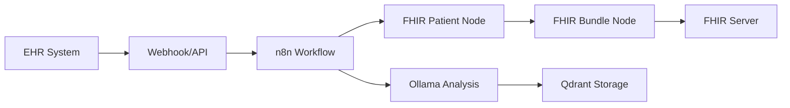

# 🚀 FHIR n8n Custom Nodes - Production Deployment Guide

**For**: `docker-compose-production.yml` - Full-stack deployment with TypeScript FHIR nodes
**Updated**: 2025-12-18
**Compatibility**: n8n latest, PostgreSQL 16, Ollama, Qdrant

---

## 📋 **Overview**

This guide covers production deployment of the complete FHIR n8n ecosystem using the `docker-compose-production.yml` configuration, which includes:

- ✅ **n8n with TypeScript FHIR Nodes** (5 nodes)
- ✅ **PostgreSQL Database** (persistent data)
- ✅ **Ollama LLM Integration** (CPU/GPU support)
- ✅ **Qdrant Vector Database** (AI/ML workflows)
- ✅ **Shared Storage & Demo Data**

---

## 🏗️ **Architecture**

### **Service Dependencies**
```
PostgreSQL (database)
    ↓
n8n-setup (builds TypeScript nodes)
    ↓
n8n (main service with FHIR nodes)
    ↓
Ollama + Qdrant (optional AI services)
```

### **FHIR Nodes Included**
1. **FHIR Patient** - Demographics and identifiers
2. **FHIR Appointment** - Scheduling data transformation
3. **FHIR Bundle** - Resource collections
4. **FHIR Claim Response** - Insurance claim responses
5. **FHIR Eligibility Response** - Insurance eligibility responses

---

## 🚀 **Quick Start**

### **Prerequisites**
- Docker Engine 20.10+
- Docker Compose 2.0+
- 4GB RAM minimum (8GB recommended)
- 10GB disk space

### **Step 1: Prepare Environment**

```bash
# Create deployment directory
mkdir fhir-n8n-production/
cd fhir-n8n-production/

# Download docker-compose and environment files
curl -O https://raw.githubusercontent.com/mudux/ruphasoft_n8n/main/docker-compose-production.yml
curl -O https://raw.githubusercontent.com/mudux/ruphasoft_n8n/main/.env.example

# Create environment file
cp .env.example .env

# Edit environment variables (IMPORTANT)
nano .env
```

### **Step 2: Configure Environment Variables**

Edit `.env` file with secure values:

```bash
# Database credentials
POSTGRES_USER=n8n
POSTGRES_PASSWORD=your-secure-password-here

# n8n security (generate secure 32+ char strings)
N8N_ENCRYPTION_KEY=your-encryption-key-here-32-chars-minimum
N8N_USER_MANAGEMENT_JWT_SECRET=your-jwt-secret-here-32-chars-minimum
```

**Generate secure keys**:
```bash
# Generate encryption key
openssl rand -hex 32

# Generate JWT secret
openssl rand -hex 32
```

### **Step 3: Launch Production Stack**

```bash
# Start all services
docker compose -f docker-compose-production.yml up -d

# Monitor setup progress
docker logs n8n-setup-typescript -f

# Wait for "TypeScript FHIR nodes setup completed successfully!"
# Then check main n8n service
docker logs n8n-production
```

### **Step 4: Access n8n**

- **URL**: http://localhost:5678
- **Setup**: Follow n8n initial setup wizard
- **FHIR Nodes**: Available in palette under "Transform" section

---

## 📊 **Service Configuration**

### **Core Services**

| Service | Port | Purpose | CPU Profile |
|---------|------|---------|-------------|
| **n8n** | 5678 | Main workflow engine | Always |
| **PostgreSQL** | 5432 | Database (internal) | Always |
| **Qdrant** | 6333 | Vector database | Always |
| **Ollama** | 11434 | LLM service | Profile-based |

### **Ollama Profiles**

**Default (CPU)**:
```bash
docker compose -f docker-compose-production.yml up -d
```

**NVIDIA GPU**:
```bash
docker compose -f docker-compose-production.yml --profile gpu-nvidia up -d
```

**AMD GPU**:
```bash
docker compose -f docker-compose-production.yml --profile gpu-amd up -d
```

---

## 🔧 **Advanced Configuration**

### **Custom Demo Data**

Place demo files in `n8n/demo-data/`:
```
n8n/demo-data/
├── credentials/
│   └── *.json
└── workflows/
    └── *.json
```

Files will be automatically imported during setup.

### **Shared Data Directory**

The `./shared/` directory is mounted for:
- File exchange between workflows
- Custom data imports/exports
- Shared resources

### **Volume Management**

**Persistent volumes**:
- `n8n_storage` - n8n data and installed nodes
- `postgres_storage` - Database data
- `ollama_storage` - Downloaded LLM models
- `qdrant_storage` - Vector database

**Backup volumes**:
```bash
# Backup n8n data
docker run --rm -v fhir-n8n-custom-nodes_n8n_storage:/source -v $(pwd):/backup alpine tar czf /backup/n8n-backup.tar.gz -C /source .

# Restore n8n data
docker run --rm -v fhir-n8n-custom-nodes_n8n_storage:/target -v $(pwd):/backup alpine tar xzf /backup/n8n-backup.tar.gz -C /target
```

---

## 🧪 **Testing & Validation**

### **Service Health Checks**

```bash
# Check all services status
docker compose -f docker-compose-production.yml ps

# Verify FHIR nodes setup
docker logs n8n-setup-typescript | grep "✅"

# Check n8n startup
docker logs n8n-production | grep -i "n8n ready"
```

### **FHIR Node Validation**

1. **Access n8n interface** at http://localhost:5678
2. **Look for FHIR nodes** in left palette under "Transform"
3. **Expected nodes**:
   - FHIR Patient (healthcare green color)
   - FHIR Appointment
   - FHIR Bundle
   - FHIR Claim Response
   - FHIR Eligibility Response

4. **Test node functionality**:
   - Drag "FHIR Patient" to workflow canvas
   - Configure with test data
   - Execute and verify FHIR output

### **Sample Test Workflow**

Create test workflow with:
```json
{
  "patient_first_name": "John",
  "patient_last_name": "Doe",
  "dob": "1990-05-15",
  "mrn": "12345"
}
```

Expected output:
```json
{
  "error": false,
  "fhir_resource": {
    "resourceType": "Patient",
    "name": [{"given": ["John"], "family": "Doe"}],
    "birthDate": "1990-05-15"
  }
}
```

---

## 🔍 **Troubleshooting**

### **Common Issues**

| Problem | Symptoms | Solution |
|---------|----------|----------|
| **Setup fails** | n8n-setup container exits | Check logs: `docker logs n8n-setup-typescript` |
| **Nodes missing** | FHIR nodes not in palette | Verify setup completed successfully |
| **Build errors** | TypeScript compilation fails | Check Node.js/npm installation in container |
| **Permission errors** | File access denied | Check volume mount permissions |
| **Database connection** | n8n can't start | Verify PostgreSQL is healthy |

### **Debug Commands**

```bash
# Check setup container logs
docker logs n8n-setup-typescript

# Check main n8n logs
docker logs n8n-production

# Inspect mounted files
docker exec -it n8n-setup-typescript ls -la /mounted-source/

# Check compiled nodes
docker exec -it n8n-production ls -la /home/node/.n8n/custom/fhir-nodes/dist/nodes/

# Test node loading manually
docker exec -it n8n-production node -e "
  try {
    const patient = require('/home/node/.n8n/custom/fhir-nodes/dist/nodes/FhirPatient/FhirPatient.node.js');
    console.log('FhirPatient loads:', patient.FhirPatient.name);
  } catch(e) {
    console.error('Error:', e.message);
  }
"
```

### **Reset & Rebuild**

```bash
# Complete cleanup
docker compose -f docker-compose-production.yml down -v
docker volume prune -f

# Fresh rebuild
docker compose -f docker-compose-production.yml up -d
```

---

## 📈 **Production Optimization**

### **Resource Allocation**

**Minimum Requirements**:
- 4GB RAM
- 2 CPU cores
- 10GB disk space

**Recommended for Production**:
- 8GB RAM
- 4 CPU cores
- 50GB disk space (for models and data)

### **Performance Tuning**

**PostgreSQL optimization** (add to service environment):
```yaml
environment:
  - POSTGRES_SHARED_BUFFERS=256MB
  - POSTGRES_EFFECTIVE_CACHE_SIZE=1GB
  - POSTGRES_WORK_MEM=4MB
```

**n8n optimization** (add to service environment):
```yaml
environment:
  - N8N_EXECUTIONS_DATA_PRUNE=true
  - N8N_EXECUTIONS_DATA_MAX_AGE=168  # 1 week
  - N8N_METRICS=true
```

### **Security Hardening**

1. **Change default ports**:
   ```yaml
   ports:
     - "8080:5678"  # Use non-standard port
   ```

2. **Add reverse proxy** (nginx, Traefik)
3. **Enable SSL/TLS** certificates
4. **Restrict network access**:
   ```yaml
   networks:
     demo:
       driver: bridge
       ipam:
         config:
           - subnet: 172.20.0.0/16
   ```

---

## 🔧 **Maintenance**

### **Updates**

```bash
# Pull latest images
docker compose -f docker-compose-production.yml pull

# Restart with updates
docker compose -f docker-compose-production.yml up -d
```

### **Monitoring**

```bash
# Service status
docker compose -f docker-compose-production.yml ps

# Resource usage
docker stats

# Service logs
docker compose -f docker-compose-production.yml logs -f
```

### **Backup Strategy**

**Weekly backups**:
```bash
#!/bin/bash
# backup-fhir-n8n.sh

DATE=$(date +%Y%m%d)
BACKUP_DIR="./backups/$DATE"

mkdir -p $BACKUP_DIR

# Backup volumes
docker run --rm -v fhir-n8n-custom-nodes_n8n_storage:/source -v $(pwd)/$BACKUP_DIR:/backup alpine tar czf /backup/n8n-data.tar.gz -C /source .
docker run --rm -v fhir-n8n-custom-nodes_postgres_storage:/source -v $(pwd)/$BACKUP_DIR:/backup alpine tar czf /backup/postgres-data.tar.gz -C /source .

# Backup configuration
cp .env $BACKUP_DIR/
cp docker-compose-production.yml $BACKUP_DIR/

echo "Backup completed: $BACKUP_DIR"
```

---

## 📚 **Integration Examples**

### **Healthcare Data Pipeline**



### **Workflow Templates**

1. **Patient Registration Flow**:
   - Input: EHR patient data
   - Transform: FHIR Patient node
   - Output: FHIR server + notification

2. **Appointment Scheduling**:
   - Input: Scheduling system webhook
   - Transform: FHIR Appointment node
   - Output: Calendar integration

3. **Insurance Processing**:
   - Input: Claims data
   - Transform: FHIR ClaimResponse node
   - Output: Payment processing

---

## 🎯 **Production Checklist**

Before deploying to production:

- [ ] **Environment configured** with secure credentials
- [ ] **All 5 FHIR nodes** appear in n8n palette
- [ ] **Test workflows** execute successfully
- [ ] **Database connectivity** verified
- [ ] **Backup strategy** implemented
- [ ] **Monitoring** configured
- [ ] **Security hardening** applied
- [ ] **Resource limits** set appropriately
- [ ] **Network access** restricted
- [ ] **SSL/TLS** certificates configured

---

## 📞 **Support**

For deployment issues:

1. **Check logs**: Container logs contain detailed error information
2. **Verify prerequisites**: Docker version, resource availability
3. **Review configuration**: Environment variables, file permissions
4. **Test components**: Individual service health checks

**Success indicators**:
- ✅ All containers running (`docker ps`)
- ✅ n8n accessible at http://localhost:5678
- ✅ All 5 FHIR nodes visible in palette
- ✅ Test workflow executes successfully

**The production deployment provides a complete, scalable FHIR transformation platform ready for healthcare data integration workflows.** 🏥

---

*Production deployment guide for FHIR n8n Custom Nodes*
*TypeScript implementation with full-stack integration*
*Updated: 2025-12-18*